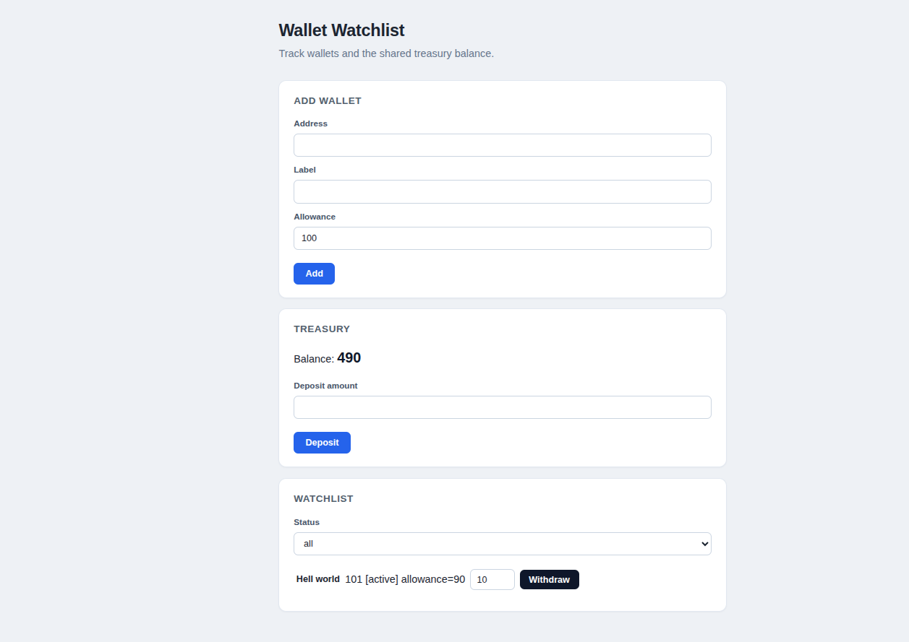

# Wallet Watchlist

A small treasury dashboard: an admin maintains a watchlist of wallets, each with a
remaining allowance, and anyone can deposit into a shared treasury balance. Only a
watchlisted wallet can withdraw, and only up to what it has left.



## Features

- Add wallets to a watchlist with a label and an allowance (admin-only)
- Deposit into the shared treasury balance
- Withdraw against a wallet's remaining allowance, capped by both the wallet's allowance
  and the treasury's actual balance
- Filter the watchlist by status (active / archived)
- Clear error and empty states throughout - nothing fails silently

## Project structure

```
src/
  server/
    ledger.js            watchlist and treasury state, all the domain rules
    request-handlers.js  translates an action + payload into a ledger call
  client/
    index.html            page markup
    watchlist-app.js       UI behavior, talks to the API over fetch
    watchlist-app.css       styles
dev-server.js             minimal server for running the app locally
```

`ledger.js` owns every invariant (wallet uniqueness, positive amounts, allowance limits,
the treasury balance) and returns `{ ok: true, ... }` or `{ ok: false, error }` for
everything it does. `request-handlers.js` is a single dispatch function,
`handleRequest(action, payload)`, that the client - or a real HTTP layer - can call
directly.

## Running it

```bash
node dev-server.js
```

Then open `http://localhost:4000`. No build step and no dependencies - `dev-server.js` is
plain Node (`http`, `fs`, `path`) serving `src/client` as static files and forwarding
`POST /api/watchlist` requests into `handleRequest`. If port 4000 is already taken on your
machine, change `PORT` at the top of `dev-server.js` and use that port instead.

To exercise the logic without a browser:

```bash
node -e '
const { handleRequest } = require("./src/server/request-handlers");
console.log(handleRequest("add", { caller: "ops", wallet: "0xA", allowance: 50 }));
console.log(handleRequest("deposit", { amount: 100 }));
console.log(handleRequest("withdraw", { wallet: "0xA", amount: 20 }));
console.log(handleRequest("list", {}));
'
```

## Docs

- [`REVIEW.md`](REVIEW.md) - a file-by-file account of the bugs found in this codebase and
  why each one mattered
- [`DESIGN.md`](DESIGN.md) - how the client/API/persistence split would evolve if this
  became a maintained service

## With more time

This was scoped tightly on purpose - fix the rules, don't grow the app. Given more time,
in rough priority order:

- **An actual HTTP server, built on Express (or similarly a Node app on the Express
  framework).** `dev-server.js` is a stand-in for manual testing, not something meant to
  carry the app. A real version would want routing, middleware for JSON parsing and
  errors, and status codes that mean something (404 for a missing wallet, 409 for an
  allowance/balance conflict), instead of every response coming back as 200 with an `ok`
  flag buried in the body.
- **Real persistence.** The ledger is a module-level array right now, which is fine for a
  take-home but means state resets every time the process restarts and can't survive more
  than one instance. A proper database with `wallets` and `transactions` tables would fix
  that and also give the transactional guarantee `withdraw` needs (see the concurrency
  section in `DESIGN.md` - this is the part I'd actually build first, not just design).
- **A cleaner split along MVC-ish lines**, now that there'd be a real server to organize:
  routes, controllers that only translate requests, and the ledger staying the single
  place domain rules live. Right now `request-handlers.js` already does the "controller"
  job reasonably well; it would just get a proper home once there's routing.
- **A broader test suite.** I wrote and ran one against `handleRequest` covering the
  rules in `assessment.md`, but it's not part of this submission. With more time I'd keep
  it, add coverage for the client-side rendering logic (the empty state, the filter, the
  XSS fix actually being safe against a few payloads, not just one), and wire it into a
  CI step so it runs on every change instead of manually.
- **Wallet archiving from the UI.** The status filter works, but nothing in this app can
  actually set a wallet to `archived` - there's no button for it. Not required by the
  brief, but the filter is only half useful without it.
- **Audit history in the UI.** `DESIGN.md` covers the case for an append-only transactions
  table on the backend; the natural client-side follow-up is a per-wallet activity log,
  so "why is this balance what it is" has an answer without reading raw ledger state.
